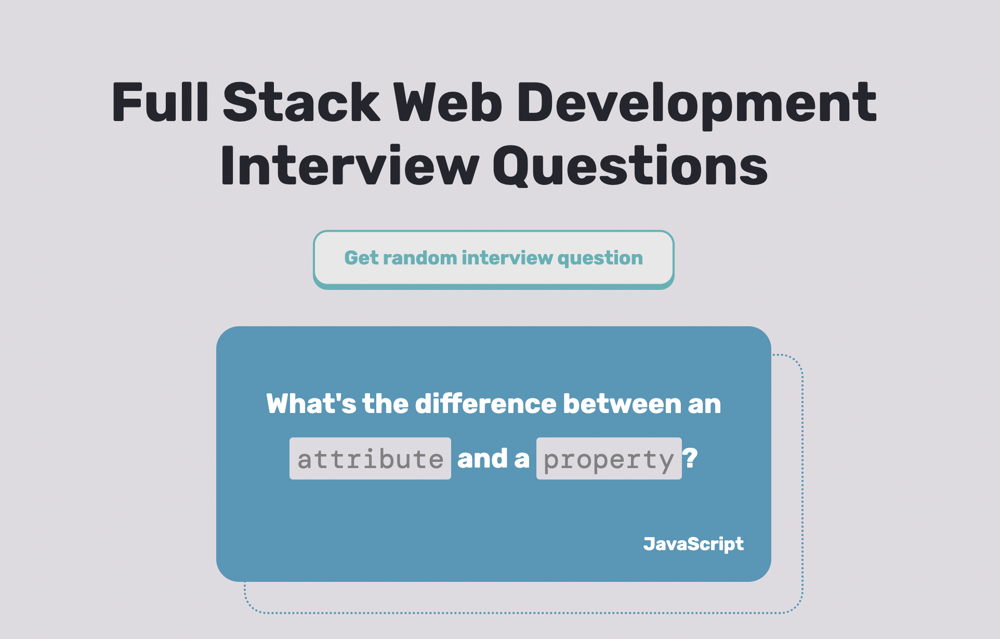

<!-- 

 -->

### 
I'm Dana, a full stack software engineer

 

  
  

 

Hi! I am a community taught software engineer with a proven track record of creating fully functional full stack web applications. I am currently looking for full time work and open to work on any interesting projects. 

### 
Go to <a href="https://danathedev.netlify.app/">my portfolio</a> for more information!

---

 

<!-- PROJECTS -->

<h2 align="center" color="white">Projects</h2>

	<table>
	 <tr width="100%"> 
		<!--project 1 -->
			<!-- <td width="50%">
				<h3 align="center" color="white">100 Hours Project</h2>
				
 
					
					 
					 
					
 -->
                        <!--repo --> 
						<!--    -->
                        <!--live site --> 
						<!-- 	
					

					<h5>JavaScript, CSS, Node, Express, Pug, MongoDB, Mongoose, Cloudinary</h5>
					

				
 -->
		<!--project 2 -->		
		
 
			<td width="50%">
                <h3 align="center" color="white">Full Stack Interview Study Buddy</h2>
                
 
                    
                     
                     
                    

                        <!--repo -->
                           
                        <!-- live site --> 
                            
                    

                    <h5>HTML, CSS, JavaScript, Node.js, Express</h5>
                    

                
  
            </td>
		

	 </tr>
			<!--project 3 -->
			<td width="50%">
				<h3 align="center" color="white">PAIHS Portfolios</h2>
				
 
					
					 
					 
					

                        <!--repo --> 
						  
                        <!--live site --> 
							
					

					<h5>JavaScript, CSS, HTML</h5>
					
An Introduction to PBATS and Mentoring at PAIHS

				

			</td>
			<!--project 4 -->
			<td width="50%">
				<h3 align="center" color="white">Coding Resources API</h2>
				
 
					
					 
					 
					

                        <!--repo --> 
						  
                        <!--live site --> 
							
					

					<h5>JavaScript, CSS, HTML, Node, Express</h5>
					
Search for over 50 resources filterable by keywords

				

	</table>

---

 

 

## Skills

  
	  
	  
	  
	   
	  
	  
	  
	  
	  

 

## Connect with me

  
  

<!--

  
  
### 
I'm Dana, a full-stack freelance developer 🚀
  
   
- 🔭 I’m currently learning the MERN stack
  
- ❓ Ask me about anything related to MERN stack and related technologies  
  
- ⚡ Fun fact: I use tabs over spaces  
  
   

## My Skill Set  
<table><tr><td valign="top" width="50%">

### Frontend  

  
  
  
  
  

</td><td valign="top" width="50%">

### Backend  

  
  
  
  
  
  
  
  

</td></tr></table>  

## Connect with me  

  

  
  

   

## Github Stats  

 
-->
